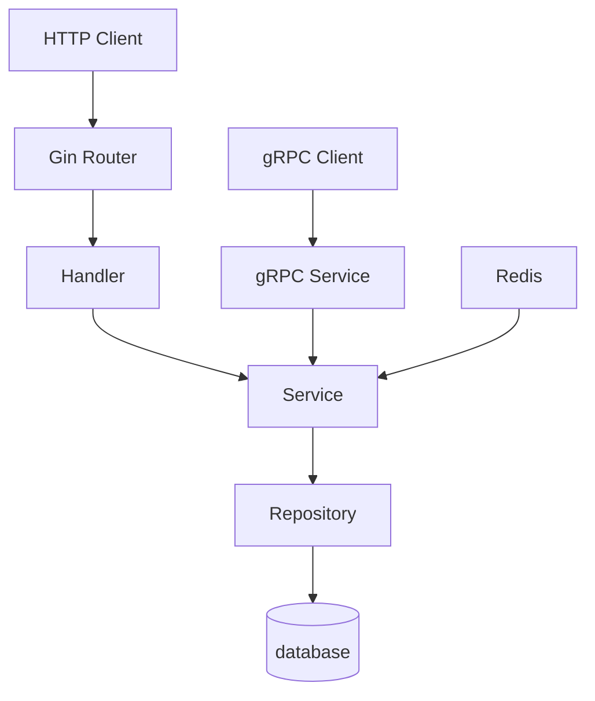

# go-web-starter

- 快速搭建业务项目
  - 已经集成gin、gRPC等基本web项目框架
  - 无业务逻辑，仅提供初始化代码，可以快速开始业务系统的开发
- 基于社区常用的分层架构规范

```mermaid
graph TD
  A[HTTP Client] --> B[Gin Router]
  B --> C[Handler]
  C --> D[Service]
  D --> E[Repository]
  E --> F[(database)]
  G[gRPC Client] --> H[gRPC Service]
  H --> D
  I[Redis] --> D
```